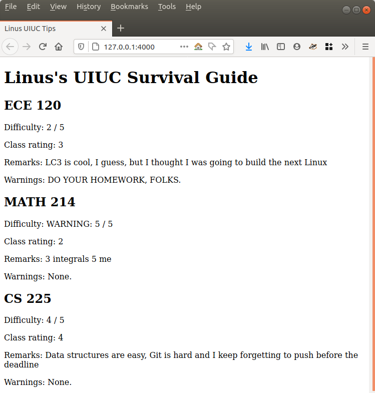

## Exercise 2: Liquid and Front Matter

Objectives:
- Learn how YAML and Liquid come together in Jekyll pages.
- Learn how to make use of Liquid tags, filters, and objects.

Readings: 
- [Part 2](https://jekyllrb.com/docs/step-by-step/02-liquid/)
- [Part 3](https://jekyllrb.com/docs/step-by-step/03-front-matter/)
- [YAML 101](https://gutsytechster.wordpress.com/2019/03/21/yaml-101/) up to and including "Multi-line Strings" if you aren't familiar with YAML. 


Now that you've read both Part 2 and Part 3, you'll be writing some HTML and Liquid in order to write each of your classes and write some notes on them! Here's what your index.html will look like...

### /index.html

```
---
classes:
    - name: ECE 120
      rating: 3
      difficulty: 2
      remarks: LC3 is cool, I guess, but I thought I was going to build the next Linux
      warnings: Do your homework, folks.
    - name: MATH 214
      rating: 2
      difficulty: 5
      remarks: 3 integrals 5 me
    - name: CS 225
      rating: 4
      difficulty: 4
      remarks: Data structures are easy, Git is hard and I keep forgetting to push before the deadline
---

<!-- Your HTML here...--->
```

, and this is what you'll get at the end:



If the above picture is ambiguous, here is what you need to implement:

- For each class, 
  - (Exercise 2.1) Print out the name as an `<h2>` element.
  - (Exercise 2.2) Print out the rating and then `/ 5` after it as a `<p>` element
  - (Exercise 2.3) If the difficulty is a `5`, print out `WARNING` and then print out the difficulty (and then optionally, a `/ 5` after it). Otherwise, just print the difficulty (and the optional `/ 5`). All of this is in a `<p>` element.
  - (Exercise 2.4) Print out the remarks for the class in a `<p>` element.
  - (Exercise 2.5) If there are warnings, print out the warnings for the class in a `<p>` element, but make sure it's all uppercase.


This might take you some time to do. If you're struggling with figuring out the Liquid, [here](https://shopify.dev/docs/themes/liquid/reference/) is the official reference. It is a quite good reference. Alternatively, feel free to Google whatever you need in order to do this (example searches: "how to loop in Jekyll", "how to uppercase text in Jekyll", etc.).

To test, run `jekyll serve`, or if that's not working, run `bundle exec jekyll serve`. When you're good, read on.

### Some final remarks

Jekyll is very good for static pages that have structured data. So, a good plan for making Jekyll pages is: 

1) Figure out the structure of your data first
2) Figure out how the page will look like
3) Write the HTML/CSS/Liquid for it.