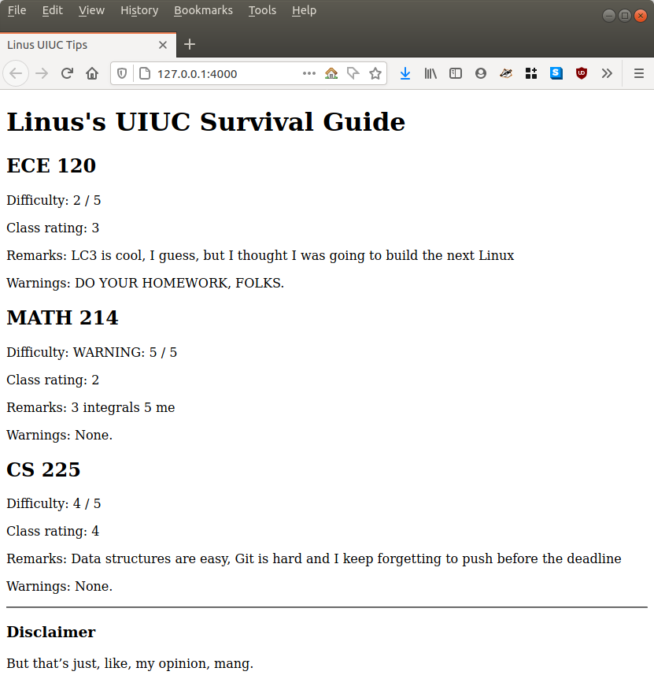
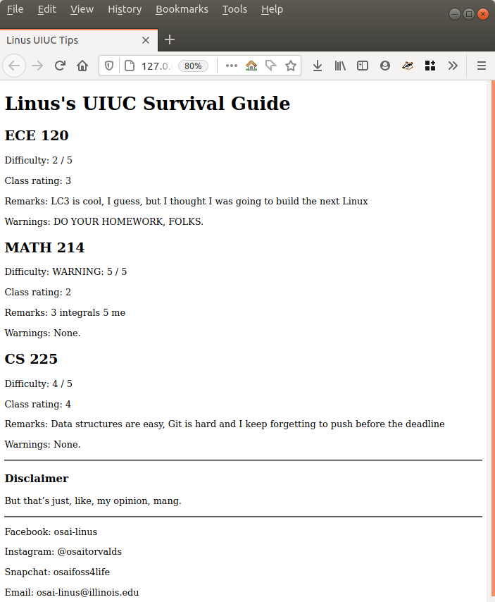
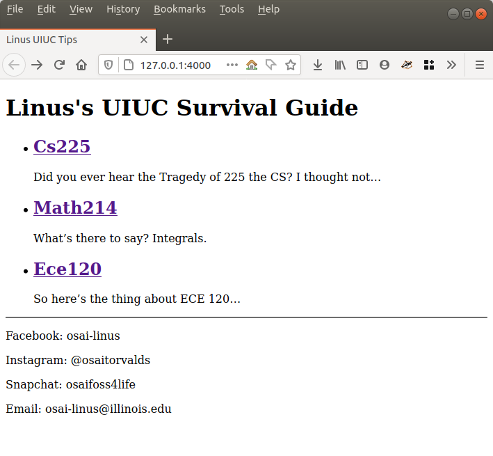
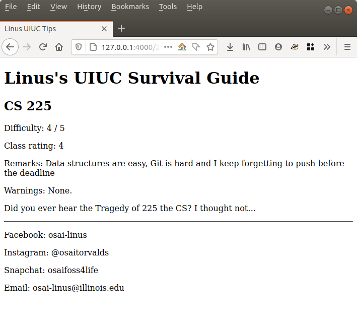

# Jekyll Workshop

Hello everybody! Welcome to the Jekyll workshop by OSAI.

You'll be going through the Jekyll step-by-step tutorial [here](https://jekyllrb.com/docs/step-by-step/01-setup/), but we'll provide a different set of exercises for you to do in order to get comfortable with Jekyll. :D

In this workshop, you'll be creating a Jekyll site to detail your tips for surviving your UIUC classes! 

So, that being said, whenever you see the page tell you to *do* something, we recommend you follow **our** step-by-step tutorial (you can also do their tutorial if you want -- it's a free country). Their tutorial is great, but it's a little lacking in giving you the experience of actually *writing* Jekyll pages.


## Important Notes

1.) We're using "Linus" as a dummy name to put. Do put your own name instead :)
2.) This tutorial is harder than the default tutorial, but it should give you a better understanding of what Jekyll is. If you have any questions, send a message in the Discord and @Sahan!
3.) If you have any improvements or suggestions to make, please make a PR to this repo, or open an issue. We'd love to use this workshop for future years in the club, so we want this to be as useful as possible!

# Table of Contents

* Exercise 1: Setup
* Exercise 2: Liquid and Front Matter
* Exercise 3.1: Using layouts to wrap your text content
* Exercise 3.2: Layouts on layouts???
* Exercise 4.1: Why don't we take our data, and push it somewhere else!?
* Exercise 4.2: Jekyll Posts
* Exercise 5: Publish on GitHub Pages!


## Exercise 1: Setup

Objectives:
- Set up Ruby and Jekyll on your own computer.
- Learn how to run a local development build of Jekyll and test your page.

Readings: 
- [Part 1](https://jekyllrb.com/docs/step-by-step/01-setup/)

Go through the procedure in Part 1 to initialize jekyll in your project. After that, create `index.html` in the root of your project such that it has "Linus's UIUC Survival Guide" as an `h1` element, and the title is "Linus UIUC Tips":

### /index.html
```html
<!DOCTYPE html>
<html>
  <head>
    <meta charset="utf-8">
    <title>Linus UIUC Tips</title>
  </head>
  <body>
    <h1>Linus's UIUC Survival Guide</h1>
  </body>
</html>
```

To test, run `jekyll serve`, or if that's not working, run `bundle exec jekyll serve`. Notice that every time you make a change in the source files in your Jekyll project, Jekyll will automatically refresh with the new content. This it really easy to see what changes you've made. When you've got Jekyll working, keep going on.

Clarification: when you go to a certain URL on the web, like google.com, what you'll first see is the contents of `index.html` under that URL. So that's why us changing our `index.html` has the consequences we see!

## Exercise 2: Liquid and Front Matter

Objectives:
- Learn how YAML and Liquid come together in Jekyll pages.
- Learn how to make use of Liquid tags, filters, and objects.

Readings: 
- [Part 2](https://jekyllrb.com/docs/step-by-step/02-liquid/)
- [Part 3](https://jekyllrb.com/docs/step-by-step/03-front-matter/)
- [YAML 101](https://gutsytechster.wordpress.com/2019/03/21/yaml-101/) up to and including "Multi-line Strings" if you aren't familiar with YAML. 


Now that you've read both Part 2 and Part 3, you'll be writing some HTML and Liquid in order to write each of your classes and write some notes on them! Here's what your index.html will look like...

### /index.html

```
---
classes:
    - name: ECE 120
      rating: 3
      difficulty: 2
      remarks: LC3 is cool, I guess, but I thought I was going to build the next Linux
      warnings: Do your homework, folks.
    - name: MATH 214
      rating: 2
      difficulty: 5
      remarks: 3 integrals 5 me
    - name: CS 225
      rating: 4
      difficulty: 4
      remarks: Data structures are easy, Git is hard and I keep forgetting to push before the deadline
---

<!-- Your HTML here...--->
```

, and this is what you'll get at the end:


If the above picture is ambiguous, here is what you need to implement:

- For each class, 
  - (Exercise 2.1) Print out the name as an `<h2>` element.
  - (Exercise 2.2) Print out the rating and then `/ 5` after it as a `<p>` element
  - (Exercise 2.3) If the difficulty is a `5`, print out `WARNING` and then print out the difficulty (and then optionally, a `/ 5` after it). Otherwise, just print the difficulty (and the optional `/ 5`). All of this is in a `<p>` element.
  - (Exercise 2.4) Print out the remarks for the class in a `<p>` element.
  - (Exercise 2.5) If there are warnings, print out the warnings for the class in a `<p>` element, but make sure it's all uppercase.


This might take you some time to do. If you're struggling with figuring out the Liquid, [here](https://shopify.dev/docs/themes/liquid/reference/) is the official reference. It is a quite good reference. Alternatively, feel free to Google whatever you need in order to do this (example searches: "how to loop in Jekyll", "how to uppercase text in Jekyll", etc.).

To test, run `jekyll serve`, or if that's not working, run `bundle exec jekyll serve`. When you're good, read on.

### Some final remarks

Jekyll is very good for static pages that have structured data. So, a good plan for making Jekyll pages is: 

1) Figure out the structure of your data first
2) Figure out how the page will look like
3) Write the HTML/CSS/Liquid for it.

## Exercise 3.1: Using layouts to wrap your text content

Readings:
- [Part 4](https://jekyllrb.com/docs/step-by-step/04-layouts/)

Objectives:
- Understand how to implement Jekyll layouts

So far, you've been writing content in YAML files. Is this all there is to Jekyll? Writing content vicariously through YAML, and writing Liquid all day long? Nope! 

One of the great things of Jekyll is that you can write in Markdown. If you've ever made posts on Reddit, StackOverflow, Discord, or even Piazza, you know a little bit about how Markdown works.

That being said, let's get into it!

Just a recap on layouts: layouts are special templates from which Jekyll makes new pages. They are stored in the special directory `_layouts`.

First, convert your `index.html` so that it's the "default" layout. Be sure to read [Part 4](https://jekyllrb.com/docs/step-by-step/04-layouts/) to understand how to make Jekyll recognize the HTML file as a layout. We want the "content" to be wrapped inside a `<div>` element.

Then, create a file `index.md`. After Jekyll parses it, it will be generated as `index.html` and Jekyll will convert all Markdown to HTML. 

This is what we are working towards:



And this is what we want `index.md` to look like in the end:

### /index.md

```md
---
layout: default
classes:
    - name: ECE 120
      rating: 3
      difficulty: 2
      remarks: LC3 is cool, I guess, but I thought I was going to build the next Linux
      warnings: Do your homework, folks.
    - name: MATH 214
      rating: 2
      difficulty: 5
      remarks: 3 integrals 5 me
    - name: CS 225
      rating: 4
      difficulty: 4
      remarks: Data structures are easy, Git is hard and I keep forgetting to push before the deadline

---

<hr/>
### Disclaimer

But these are just, like, my opinions. Pls don't sue. 
```

(Sidenote: Mixing HTML and Markdown is a-okay -- Jekyll will do a pass on the file to convert all Markdown to HTML later anyway.)
To test, run `jekyll serve`, or if that's not working, run `bundle exec jekyll serve`. When you're good, read on.


## Exercise 3.2: Layouts on layouts???

Readings:
- [Part 4](https://jekyllrb.com/docs/step-by-step/04-layouts/)

Objectives:
- Understand how to reuse encapsulating HTML by layering layouts

Yes, that's right! You're able to create layouts based on other layouts. This is good when you want to reuse encapsulating aspects of your page.

What if our page detailing tips on how to survive UIUC classes goes viral, and people want to know what glorious individual came up with these tips? We need an About page!

But hold on...the code for our ratings system is in the `default` layout. That means that we'd get a bunch of text and HTML that's really not useful for an About page (that's meant for putting class ratings). But we still want to reuse the title of the page, and maybe a footer with our social media (when we refactor), and anything else that we might want to surround our content! What do we do?!?!?!

The solution is straightforward: we split our current layout into two layouts:
- `_layouts/default.html`, which will ONLY have the required meta-HTML tags (like `<head>`, `<!DOCTYPE>`), and the title of our page (in the `<h1>` tag)
- `_layouts/ratings.html`, which will have all the Liquid and code that we wrote in Exercise 2.

You can do this by...you guessed it, putting `layout: default` in the front matter of `_layouts/ratings.html`!

After you've successfully refactoring our initial layout as two separate layouts, create an `about.md` page at the root of your project directory, with this content (or something similar):

### /about.md
```
---
layout: default
---

## About Me

My name is Linus OpenSourceMan, and I'm a student at the University of Illinois at Urbana-Champaign. I really like pumpkins, but I love open source more!

```

Your `index.md` should look the exact same, EXCEPT for the fact that it has `layout: ratings` instead of `layout: default`. The actual `index.html` page when you test it should look the same as it did last time.

Your `about.html` page should look something like this:


By the end, this is what your directory structure should look like:

```
.
├── about.md
├── Gemfile
├── Gemfile.lock
├── index.md
└── _layouts
    ├── default.html
    └── ratings.html
```

To test your `index.html`, run `jekyll serve`, or if that's not working, run `bundle exec jekyll serve`. 
To test your `about.html`, run the above commands and then navigate to `http://127.0.0.1:4000/about.html`.

When you're good, read on.

## Exercise 4.1: Why don't we take our data, and push it somewhere else!?

Readings:
- [Part 6](https://jekyllrb.com/docs/step-by-step/06-data-files/)

So, let's say on this website, you also wanted to put some of your social media so that people who benefited from your website can see what you've been up to. But, where do we put our handles and usernames?

Moreover, how are we going to access that data from multiple places on the website?

There are two approaches: one is using `_config.yml`, which is a special file at the root of the directory for site-wide configurations. However, this is really inconvenient for development: `jekyll serve` will NOT automatically refresh if you make changes to your `_config.yml`. This makes debugging insane. Trust me, I know. So, we're going to reserve `_config.yml` for *actual* site configurations and not for simple text stuff like social media handles. 

For our social medias, we're going to use one of Jekyll's magic directories: `_data`. We can put all of our class data in a file under this directory, say for example `_data/social.yml`, like so:

### /_data/social.yml

```yaml
facebook: osai-linus
instagram: "@osaitorvalds" # In YAML, if your string has an @ sign in the beginning, you need to put the string in quotes
snapchat: osaifoss4life
email: osai-linus@illinois.edu
```

, and then we can access this data by using the Liquid variable `site.data.social`. Because the `social.yml` file is located in `_data`, it is available site-wide as `site.data.social`. Contrast this to `page.classes`, which is in `index.md`: because the `classes` YAML entry is defined in the front matter of the page `index.md`, it is available under the `page` variable and not the `site.data` variable.

Go ahead and complete the refactor: make a new directory `_data` and a new file `_data/social.yml`, move all the data into `_data/social.yml`, and update your `_layouts/default.html` to have a horizontal rule element (`<hr/>`) and then your social handles at the bottom of the webpage as a bunch of `<p>` tags -- by the end, your browser should look like this:




By the end, this is what your directory structure should look like:

```
.
├── about.md
├── _data
│   └── social.yml
├── Gemfile
├── Gemfile.lock
├── index.md
└── _layouts
    ├── default.html
    └── ratings.html
```

To test your `index.html`, run `jekyll serve`, or if that's not working, run `bundle exec jekyll serve`.

When you're ready, keep reading.

## Exercise 4.2: Posts, at last!

Readings:
- [Part 8](https://jekyllrb.com/docs/step-by-step/08-blogging/)

Currently, we just list all of the classes we've taken so far on the front page. While this is certainly an approach, this is not exactly scalable -- after all, we're going to be at UIUC for a while, and we'll be taking a good amount of courses. So, what do we do?

Conveniently, Jekyll has this notion of "posts". Posts are subpages in your site, kind of like what blog posts might be. Posts live in the magic Jekyll directory `_posts` in the root of your directory, and each file has the special (and mandatory) format `YYYY-MM-DD-title.md`. Jekyll will pull the post title and date from the filename, and it will get all the other necessary data from the post file contents.

Posts are part of what make Jekyll great for things like keeping track of recipes, book reports, blogging, and whatnot. So, let's get to it!

Step 1 is to split the "classes" YAML entry in `index.md` into three different files, and set the layout to "ratings" in the frontmatter:

### /_posts/2020-11-09-ECE120.md

```
---
layout: ratings
name: ECE 120
rating: 3
difficulty: 2
remarks: LC3 is cool, I guess, but I thought I was going to build the next Linux
warnings: Do your homework, folks.
---

So here's the thing about ECE 120...
```

### /_posts/2020-11-10-MATH214.md

```
---
layout: ratings
name: MATH 214
rating: 2
difficulty: 5
remarks: 3 integrals 5 me
---

What's there to say? Integrals.
```

### /_posts/2020-11-11-CS225.md

```
---
layout: ratings
name: CS 225
rating: 4
difficulty: 4
remarks: Data structures are easy, Git is hard and I keep forgetting to push before the deadline
---

Did you ever hear the Tragedy of 225 the CS? I thought not...
```

Step 2 is to change the ratings layout so that it no longer iterates through the classes variable, and instead, it just takes the data from the page itself. 

(Hint: this involves removing the "for" loop and changing the variable names: hint 2: where do the variables come from? The `page` or the `site`?)

Step 3 is to create a new layout `_layouts/home.html` based on the default layout so that we can put a link to each post!

By the end, your homepage should look something like this:



And each post should look something like this -- example for the CS225 page:




By the end, your file structure should look something like this:

```
.
├── about.md
├── _data
│   └── social.yml
├── Gemfile
├── Gemfile.lock
├── index.md
├── _layouts
│   ├── default.html
│   ├── home.html
│   └── ratings.html
└── _posts
    ├── 2020-11-09-ECE120.md
    ├── 2020-11-10-MATH214.md
    └── 2020-11-11-CS225.md
```

To test your `index.html`, run `jekyll serve`, or if that's not working, run `bundle exec jekyll serve`.
When you're ready, keep reading.


## Exercise 5: GitHub Deployment!

Reading:
- [Jekyll GitHub Pages Documentation](https://jekyllrb.com/docs/github-pages/)

Phew, you've finally made it to the end! All that's left for you to do is to put your website on GitHub Pages.
So, step 0 would be to create a `.gitignore` to make sure we don't commit any of Jekyll's build files:

### /.gitignore
```
_site/
.sass-cache/
.jekyll-cache/
.jekyll-metadata
```

Step 1 would be to follow the instructions in the reading to make your Jekyll project compatible with GitHub (by adding the "github-pages" gem and by putting the `relative_url` filter where necessary).

Step 2 would then to be initialize a git repository in the root of the project, add everything with `git add .` and commit everything with `git commit -m "Initial commit"`, and then create a GitHub repo on your account and push your Jekyll project to GitHub.

After that, follow the instructions [here](https://forestry.io/docs/guides/hosting/github-pages-jekyll/) to get your pages up and running. And then you're done!


## What's next?

Well, as you can see, the page you have now is missing a few things. For example,

* There's no navigation mechanism to get from one page to another, except for going into posts.
* Only raw HTML is being rendered -- there's no styling at all.
* There are plenty of cool little plugins to use for Jekyll, like an RSS plugin.

And more! You can either fix up this workshop project and make it your own, or you can start anew with a Jekyll template and start modifying it to your heart's content. Example: https://github.com/jekyll/minima. (Fun fact, https://open-source-at-illinois.github.io/workshops/ is based off of this theme!)

You can also start exploring Jekyll Themes to use for your next blogging project/documentation-like project. Though it might seem like everything costs money, there are a good number of polished, free Jekyll templates to use.

That's it. Have fun!